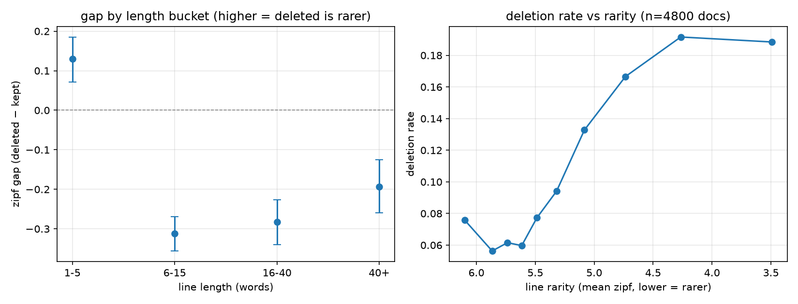
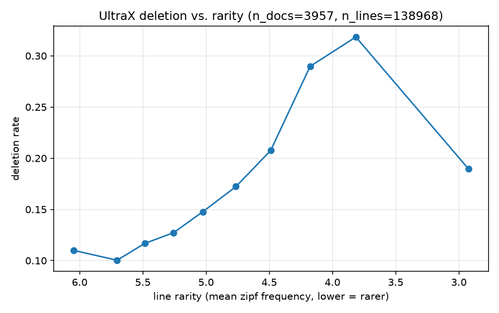

<div align="center">

# SliceAudit — Sliced Auditing of Data Refinement Pipelines

**Does industrial data refinement help everyone — or only the head of the distribution?**

> 中文说明见[文末](#中文说明)。

[](https://doi.org/10.12074/202609.00041)
[]()
[](LICENSE)

**A preregistered audit that reports its own negative result.**
Stage A found a real effect. Stage B's preregistered kill criterion fired — and that is the finding.

[结论](#结论先说) · [问题](#the-question) · [方法](#method) · [预注册](#preregistered-design) · [阶段 A](#阶段-a做了什么) · [阶段 B](#阶段-b裁决点)

</div>

---

## 结论先说

| 阶段 | 状态 | 结果 |
| --- | --- | --- |
| **A** 审计侧 | ✅ 完成 | 删除是**位置性**的，不是稀有度性。rarity 主效应 +0.096（p=0.43，不显著）；pos OR≈0.23（p≈1e-48） |
| **B** 下游侧（E2 裁决点） | ⚠️ **预注册的 kill criterion 触发** | 精炼语料训练的探针在 head 和 tail 上**同样变差**（head +0.375 / tailK +0.362），是全局分布收窄，**不是**切片特异的尾部惩罚 |

**这份工作的价值不在于"我证明了什么"，而在于它是一套会自己咬自己的验证机制：**

- 假设、终点、kill criterion、禁止的难度代理，全部在**看到任何结果之前**冻结在
  [`configs/preregistration.md`](configs/preregistration.md)（commit `4be6a272c9`）
- 阶段 A 的探索性结果被显式登记为 §7，**不算**事后合理化
- 自己的机制假设被自己的机械零模型（T2）判定为机械效应后**主动降级**（§2 v1.1 修订）
- 裁决点跑出 NO-GO，就按预注册走 informative null，而不是换个指标再试一次

> 诚实的披露也写在预注册里：本文采用**序贯设计**——阶段 A 先探索，阶段 B 的确认性终点在
> 阶段 B 任何结果产生**之前**冻结。这个设计选择是公开的，不是事后辩解。

## The question

Data quality is now a first-class lever in LLM training. FaceWall's **UltraX**
(arXiv:2607.08646) is a representative industrial refinement pipeline: a 0.6B model predicts
structured edit operations (`keep / delete / replace / insert`), and a deterministic executor
applies them to raw corpus text.

UltraX reports that a 1B model trained on 16B refined tokens beats one trained on 20B raw tokens.
**That is an aggregate result.** It does not say *for whom* refinement helps.

This project asks the question UltraX did not:

> **Are the edit operations systematically skewed on long-tail / rare concepts?
> And when does a cheap quality metric stop predicting actual gains?**

## Why this might be true

A refinement model is trained to maximise aggregate quality. Rare concepts are, by definition,
under-represented in that objective. There is therefore a plausible mechanism for
**tail-specific deletion**: content that is rare, unusual, or off-distribution looks
"low quality" to a model optimised for the head.

If that happens, the aggregate gain hides a **slice-level loss** — exactly the pattern that
aggregate metrics are known to mask.

## Method

The key design choice: **UltraX is the object under audit, not a tool we use.**
`openbmb/UltraX-Preview` ships a `(raw text, refined text, edit operations)` triple —
a ready-made controlled experiment with full intervention traces, available for free.

| Stage | What | Cost |
|---|---|---|
| **A** | Count edit-operation types stratified by rarity. Primary test: `deletion rate × rarity stratum` interaction. | **No GPU** |
| **B** | Train 150M–500M probes on raw vs. refined corpus; measure **sliced** downstream delta. | 8GB single card |
| **C** | Calibration curve: cheap quality metric ↔ sliced gain, and where it breaks. | 8GB single card |

### Dependent variable is a *sliced delta*, not an average

This is the line between an audit and a reproduction report. UltraX proved aggregate
effectiveness; it did not prove *for whom*. We report per-slice deltas.

## Pre-registered design

- **Primary endpoint (intersection–union test)**: (i) interaction term `edit × rarity` CI excludes 0
  **AND** (ii) tail-slice loss is significant under a binomial test. Both must hold.
- **Kill criterion**: if refinement is *also* better on the tail, the hypothesis is dead.
  We then run a **TOST equivalence test** and publish an informative null.
- **Confound control**: difficulty must use an **independent** proxy (reasoning steps / length /
  human annotation). **Pass rate and NLL are forbidden** as difficulty proxies — they are
  already rarity proxies, which would make the interaction term circular.
- **Negative controls**: deletion applied to *head* slices; unstructured noise at matched
  intensity; 500 label permutations for the null distribution of the interaction.
- **Training noise**: ≥3 (target 5) seeds with explicit variance decomposition.
  Sample-level bootstrap alone underestimates CI for QLoRA runs.

See [`docs/RESEARCH_PLAN.md`](docs/RESEARCH_PLAN.md) and [`configs/preregistration.md`](configs/preregistration.md).

## 阶段 A：做了什么

对 UltraX 在 **4 个语料**（AICC / FineWeb / RedPajama-V2 / Ultra-FineWeb）**4800 篇文档、101250 行**
上的审计，建立了五个事实：

| # | 事实 | 证据 |
|---|---|---|
| F1 | 朴素"稀有 → 删除"假设在正文行**不成立**（rarity 主效应 +0.096，p=0.43） | `01_slice_audit.py` M1 |
| F2 | **位置是主导预测因子**（pos OR≈0.23，p≈1e-48），删除率随文档位置单调升 | M1 |
| F3 | **稀有度效应被位置门控**：rarity×pos = −0.916（p≈4e-39）——开头稀有行被保留（OR≈1.8），尾部稀有行被砍 | M3 |
| F4 | 结构性通道独立：OOV 行 OR≈0.07；标题行强保留（OR≈100） | M2 |
| F5 | 跨语料方向一致、强度分档：AICC −0.46 / RedPajama −0.48 / FineWeb −0.15 / Ultra-FineWeb −0.12 | `step2_summary.json` |

<p align="center">
  
  <br>
  
</p>

### 主动降级：自己的假设被自己的零模型否定

预注册里的 E1b（`rarity × pos < 0`，本该是承重机制证据）被 **T2 机械零模型**检验：

> 后缀截断模拟系数 **−0.966** ≈ 观测 **−0.916**

也就是说，这个交互**完全能由"尾截规则 × 源语料稀有-位置相关"复现**，
并没有提供"清洗器稀有度感知"的证据。**E1b 因此被降级为探索性操纵检查**，
不再作为发现宣称（预注册 §2 v1.1 修订，2026-09-08）。

这是整个项目里最该被看见的一步：承重假设被自己设计的对照杀掉，然后写进修订日志。

## 阶段 B：裁决点

协议见 [`docs/STAGEB_PROTOCOL.md`](docs/STAGEB_PROTOCOL.md)。

### 为什么从零训探针，而不是拿预训练模型做 CPT

三条可辩护的理由（早期"续训对语料差异钝感"的措辞被搜文献否决为不可辩护的普适命题）：

1. **基座锚定** —— raw 与 refined 共享约 85% 的行，追加训练的差分信号被已预训练权重锚定淹没
2. **遗忘偏置** —— Chang et al. (NeurIPS'24, arXiv 2406.11813) 证明低暴露的边际事实最先被遗忘；
   CPT 恰好擦除想测的尾部信号
3. **协议镜像** —— UltraX 自身的验证就是"从零训"，审计对方声明须用对方协议

### 防泄漏：评估不能是"测的就是训过的"

以 **raw 原始文档**为不可再分单元做三向切分（Calibration 20% / Train 60% / Eval 20%），
加**簇级 5-gram Jaccard ≥ 0.8 近重去重**——web 语料去重不彻底时，仅靠 doc-hash 会被近重文档击穿。

### 结果

| 切分 | Δ（refined − raw） | 含义 |
|---|---|---|
| **head** | **+0.375** | 精炼训练的探针在头部也变差 |
| **tailK**（知识承载尾部行） | **+0.362** [0.254, 0.481] | 与 head **几乎一样** |
| null check（同臂跨 seed） | +0.04 – 0.12 | 训练噪声基线 |

按预注册的 **kill criterion**（"若精炼在尾部**也**更好 → 假设整体死亡，走 TOST 发 informative null"），
本次结果为 **NO-GO**：观察到的是**全局分布收窄**，而非切片特异的尾部惩罚。

扩大到 2000 篇文档（`eval2k`）复跑后：head +0.216 / tailK +0.413 / tailN +0.706 ——
**全局位移与尾部超额同时存在**，且此前 200 篇的前缀对 head 不具代表性。

> 这个结果**不推翻**阶段 A 的位置性发现——阶段 A 测的是"清洗器删了什么"，
> 阶段 B 测的是"下游探针学到了什么"。两者是不同的因变量。
> 但它确实**推翻了**"位置门控在切片层面系统性牺牲长尾内容因而伤害下游"这条叙事链的下游一环。

## Repository layout

```
src/00_probe_ultrax.py     Stage A step 0 — stream-probe UltraX-Preview 的真实 schema
src/01_slice_audit.py      Stage A 主审计（编辑操作 × 稀有度分层）
src/02_gate_regression.py  Stage A 门控回归
src/03_e1c_wordloss.py     E1c 词级损失分析
src/04_mechanical_null.py  T2 机械零模型
src/stageb/00_prep_slices.py   Stage B 切片构造（三向切分 + 簇级去重）
src/stageb/01_train_probe.py   Stage B 探针训练（raw / refined 两臂）
src/stageb/02_eval_slices.py   Stage B 分层评估
src/stageb/03_gate.py          Stage B 四门判据聚合（doc 级配对 bootstrap）
docs/RESEARCH_PLAN.md      完整研究计划
docs/STAGEB_PROTOCOL.md    Stage B 协议（含审稿人最可能打死的 3 点及缓解）
configs/preregistration.md 预注册（结果产生前冻结）
figures/                   插图
reports/                   产物（大中间体 gitignored）
```

## Quick start

```bash
# 1. 把 HuggingFace 缓存指到大盘（C: 太小，见 SETUP.md）
export HF_HOME=/e/hf-cache
export HF_ENDPOINT=https://hf-mirror.com      # 国内镜像

# 2. 安装
pip install -r requirements.txt

# 3. 流式探测数据集 schema（不会下载完整 487GB）
python src/00_probe_ultrax.py --n 200
```

Stage B 的运行方式（GPU）见 [`docs/RUN_GUIDE.md`](docs/RUN_GUIDE.md)：
4060 Laptop 8GB 上实测 ~32–38k tok/s，50M 探针 2000 步约 30–50 分钟/次，2 臂 × 3 seeds 约 3–5 小时。

## Roadmap

- [x] 研究计划 + 预注册冻结
- [x] **Stage A step 0**：确认 UltraX 三元组 schema
- [x] 稀有度分层协议
- [x] Stage A：编辑操作 × 稀有度分布（**无 rarity 主效应；删除是位置性的**）
- [x] T2 机械零模型 → **E1b 主动降级**
- [x] **预印本发布于 ChinaXiv**（2026-09-08）— [DOI 10.12074/202609.00041](https://doi.org/10.12074/202609.00041)
- [x] Stage B 探针训练与分层评估（6/6 训练 + 3 seed）— **NO-GO per prereg**
- [ ] TOST 等价性检验 → informative null 正式写入论文
- [ ] Stage C：校准曲线与失效边界

## Citation

```bibtex
@misc{huang2026sliceaudit,
  title  = {SliceAudit: Positional Tail-Truncation in LLM Data Refinement --- A Sliced Audit of UltraX},
  author = {Huang, Hao},
  year   = {2026},
  doi    = {10.12074/202609.00041},
  note   = {ChinaXiv preprint, ChinaXiv:202609.00041V1}
}
```

## Attribution

This work audits **UltraX** (arXiv:2607.08646) and uses `openbmb/UltraX-Preview`
(Apache-2.0). We are grateful to the OpenBMB / MiniCPM team for open-sourcing not just
weights, but the data-refinement pipeline and its intervention traces — that decision is
what makes this audit possible at all.

---

## 中文说明

本项目审计工业级数据精炼流水线（以面壁 UltraX 为**被测对象**）在**长尾/稀有概念**上的系统性偏斜。

**核心设计：因变量是分层 delta，不是平均分**——这是"审计"与"复现报告"的分界线。
全流程在单张 RTX 4060 Laptop 8GB 上可复现。

**结果分两层：**

- **阶段 A（成立）**：删除是**位置性**的，不是稀有度性的。rarity 主效应 +0.096（p=0.43，不显著）；
  位置 OR≈0.23（p≈1e-48）；rarity×pos = −0.916（p≈4e-39），稀有度效应被位置门控。
- **阶段 B（裁决点 NO-GO）**：精炼语料训练的探针在 head（+0.375）与 tailK（+0.362）**同样变差**，
  是**全局分布收窄**，不是切片特异的尾部惩罚。按预注册的 kill criterion，这属于 informative null。

**方法学上最值得看的一点**：预注册的承重机制假设 E1b 被项目**自己设计的机械零模型**否定
（模拟系数 −0.966 ≈ 观测 −0.916），于是**主动降级**并写进修订日志；
阶段 B 裁决点跑出 NO-GO，也按预注册停下，而不是换个指标再试。

**状态**：预印本已发布于 ChinaXiv（2026-09-08，DOI [10.12074/202609.00041](https://doi.org/10.12074/202609.00041)）。
预印本发表时阶段 B 标为 OPEN；上述阶段 B 结果为发表后的新增工作，NO-GO 结论以本文与
仓库 commit 为准，informative null 的正式版待写入论文 v2。
